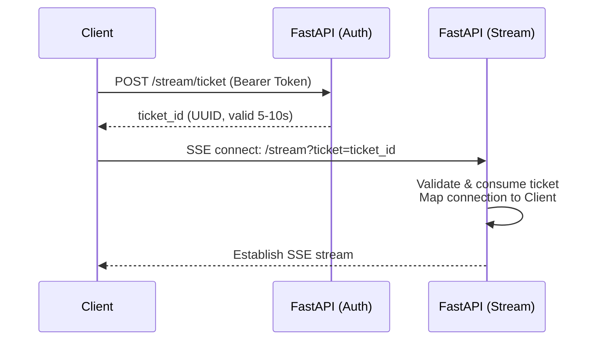

```mermaid
sequenceDiagram
    participant C as Client
    participant A as FastAPI (Auth)
    participant S as FastAPI (Stream)

    C->>A: POST /stream/ticket (Bearer Token)
    A-->>C: ticket_id (UUID, valid 5-10s)
    C->>S: SSE connect: /stream?ticket=ticket_id
    S->>S: Validate & consume ticket<br/>Map connection to Client
    S-->>C: Establish SSE stream
```