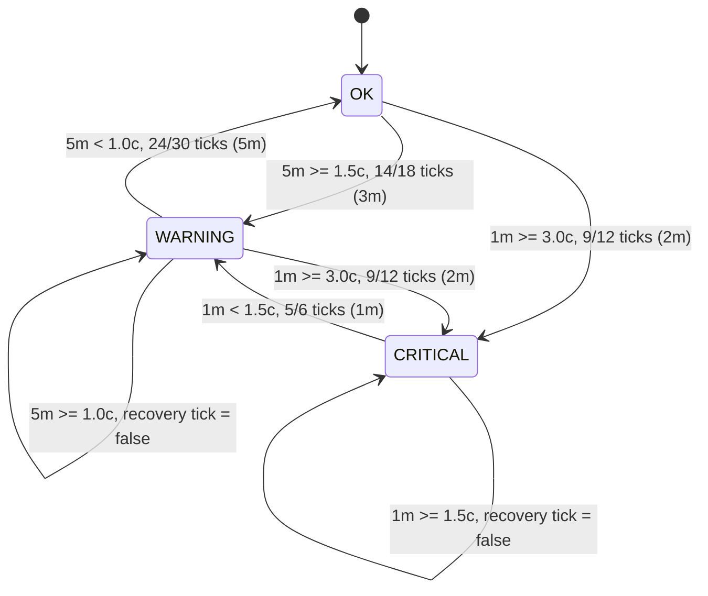

# Load Average State Machine

- Window: rolling N-of-M tick classification, one tick per 10s (10 samples).
- Trigger windows: `warning_ticks` (maxlen 18), `critical_ticks` (maxlen 12).
- Recovery windows: `warning_recovery_ticks` (maxlen 30), `critical_recovery_ticks` (maxlen 6).
