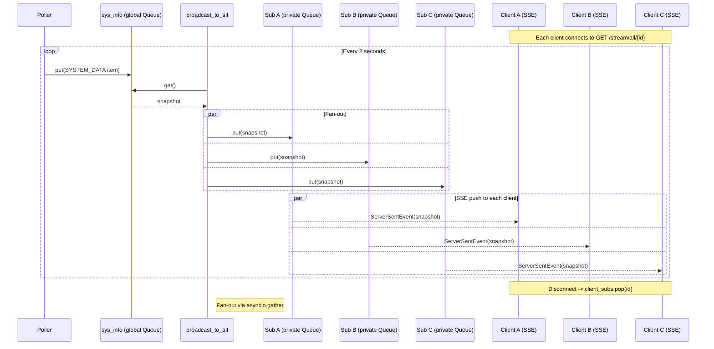
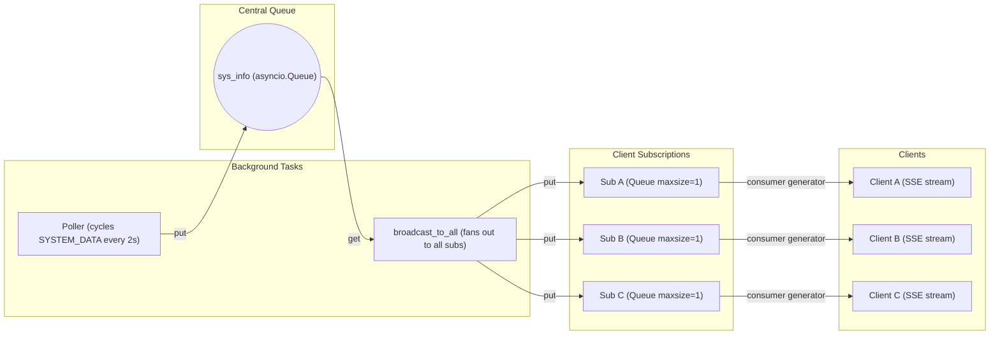

# Streaming Endpoint Architecture

## Sequence Diagram

## Component Diagram

## Data Flow Summary

| Step | Component                  | Action                                                                                  |
|------|----------------------------|-----------------------------------------------------------------------------------------|
| 1    | `poller`                   | Iterates `SYSTEM_DATA`, puts item into `sys_info` queue, sleeps 2s                      |
| 2    | `broadcast_to_all`         | Awaits `sys_info.get()`, then fans out via `asyncio.gather` to every `sub.queue`        |
| 3    | `Subscription.consumer()`  | Each client's async generator awaits `self.queue.get()`, yielding `ServerSentEvent`     |
| 4    | FastAPI SSE                | `EventSourceResponse` wraps the generator, pushing events to the HTTP response          |

### Key Implementation Details (`app/app.py`)

- **`client_subs: dict[str, Subscription]`** — Maps client id → Subscription (created at `app/app.py:60`)
- **`sub_lock: asyncio.Lock`** — Guards concurrent access to `client_subs` (created at `app/app.py:62`)
- **`GET /stream/all/{id}`** — Drops old sub if exists, creates new `Subscription`, streams until disconnect (`app/app.py:83-100`)
- **`Subscription.queue`** — Private per-client queue with `maxsize=1` — newest snapshot replaces old if client is slow (`app/app.py:52`)
- **`broadcast_to_all`** — Runs forever, pulls from `sys_info`, pushes to all subs simultaneously (`app/app.py:14-22`)
